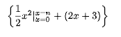
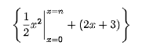
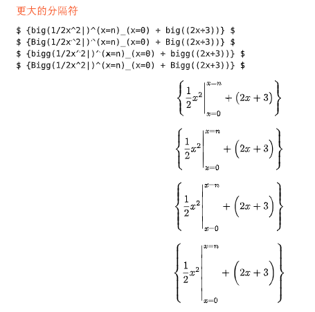
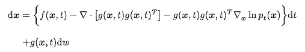
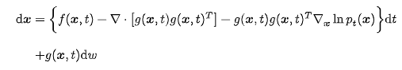

## 放大分隔符

`embiggen` 包可以自动放大数学公式中的分隔符（如括号、竖线等），使其与公式内容高度匹配，提升公式的视觉效果。

### 基础用法

**原始效果：**

```typ
$ {1/2x^2|^(x=n)_(x=0) + (2x+3)} $
```




**使用 `embiggen` 后：**

```typ
#import "@preview/embiggen:0.0.1": *

$ {lr(1/2x^2|)^(x=n)_(x=0) + (2x+3)} $
```



放大公式内的分割符后，外层的括号也会相应的放大。`embiggen`只会放大分隔符，不会放大公式里的其他符号。

更多例子如下



## 放大各种大括号

可以使用 `embiggen` 包来单独放大括号。

原始的放大括号使用方法

```typ
$
  "d" bold(x) &= stretch(brace.l, size: #200%) f(bold(x), t) - nabla dot [g(bold(x),t)g(bold(x),t)^T] - g(bold(x),t) g(bold(x),t)^T nabla_(bold(x)) ln p_t (bold(x))stretch(brace.r, size: #200%) "d" t\
  &+ g(bold(x),t) "d" w
$
```

效果如下图所示


使用 `embiggen` 包

```typ
#import "@preview/embiggen:0.0.1": *

$
  "d" bold(x) &= bigg(brace.l) f(bold(x), t) - nabla dot [g(bold(x),t)g(bold(x),t)^T] - g(bold(x),t) g(bold(x),t)^T nabla_(bold(x)) ln p_t (bold(x)) bigg(brace.r) "d" t\
  &+ g(bold(x),t) "d" w
$
```

效果如下图所示



更多使用方法参考 [文档](https://typst.app/universe/package/embiggen)
